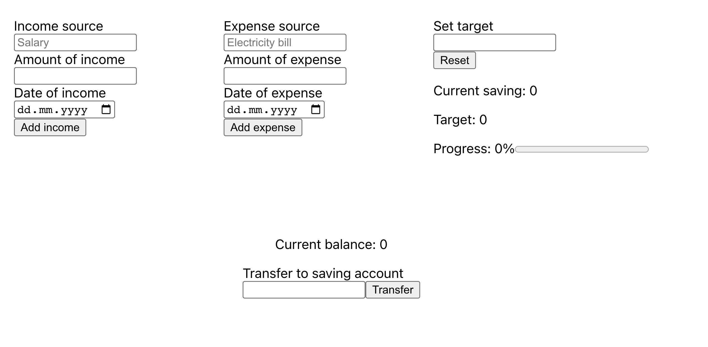
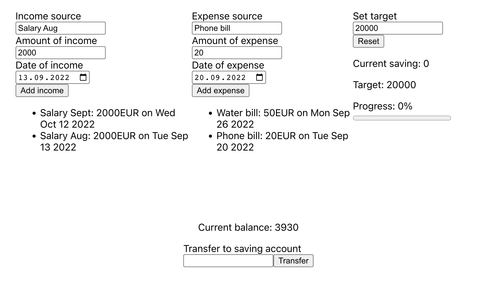
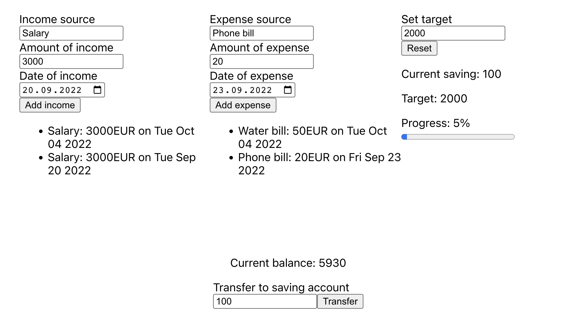

# Budget Control App

## Name of the project

**Front-end educational project:** Budget Control App

## Demo

[Click to view the live demo](https://cah4o.github.io/Integrify-Finland-BoF-budget-control-app/)

## Tech Stack

- HTML, CSS
- TypeScript
- React
- Redux
- Material UI
- React Hook Form
- localStorage
- Jest (for testing)

## Description

This application helps manage a budget by tracking income, expenses, savings, and balance. Each data category is stored in global state and saved to localStorage for persistence.

Key features:

- Four main blocks: **Income**, **Expenses**, **Savings**, and **Balance**
- Responsive design using **Material UI** and **Flexbox**
- Theme toggle (light/dark mode) using **Material UI's** palette and context API
- State management using **Reducer** and **Context Provider**
- Written with **TypeScript** and tested with **Jest**

By building this project, I improved my skills in React, Material UI, state management, and data storage in the browser.

## Project Requirements (by the Academy)

- Create a React-based budget app using JavaScript or TypeScript
- Implement styling and save data in local memory (localStorage)
- Include the following logic blocks: Income, Expenses, Savings, Balance
- Provide test coverage
- Reference screenshots as an example

Screenshot 1:


Screenshot 2:


Screenshot 3:


## 🚀 Getting Started

### In the project directory, you can run:

Installs all the necessary dependencies.

```bash
npm init
```

Runs the app in development mode. Open http://localhost:3000 to view it in your browser. The page reloads on edits, and lint errors will be shown in the console.

```bash
npm start
```

## Learn More

You can learn more in the [Create React App documentation](https://facebook.github.io/create-react-app/docs/getting-started).

To learn React, check out the [React documentation](https://reactjs.org/).
